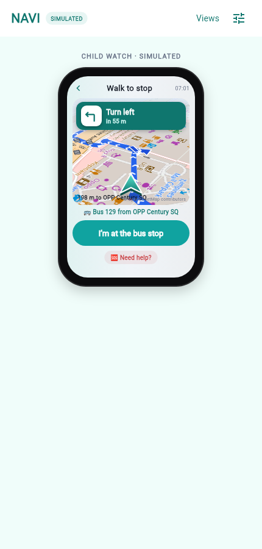

# NAVI

NAVI is a Flutter Web prototype for the NEBULA X / LTA Smart Commuter Companion problem. It demonstrates a child's watch-style journey view, a parent's phone view, and a combined view with one shared mock state. All places, timing, maps, bus arrivals and notifications in this build are **simulated**.

## Persona and how this answers PS2

The NEBULA X PS2 brief (Smart Commuter Companion) lets teams propose their own persona. NAVI builds for **Maya, a primary school child (7 to 12) travelling alone**, with her parent as the second user. This is a stricter case of the brief's Mdm Lim persona: the whole trip must be planned door to door in advance, the child must never be asked to improvise a reroute, every instruction must be one short line with a picture, and someone else needs to know when something goes wrong. The three mandatory capabilities map as follows:

- **Route planning (3.2.1):** door-to-door OneMap itineraries, re-planned from the child's actual position when a condition matters, with the reason shown to both users. Rain doubles the cost of walking minutes in the ranking; crowding and delays produce advice or a reroute.
- **GIS on OpenStreetMap (3.2.2):** OSM is the basemap on every map (community-hosted OSM tiles, cached per session, with a `--dart-define` hook for a keyed provider, so the OSMF tile server is not hammered) and the source of the pedestrian detail the child needs: crossings, steps and sheltered walkways along each walk, and staffed "safe places" near the child when she asks for help. All OSM data is fetched through Overpass, cached on disk, and shown with "© OpenStreetMap contributors".
- **Visualisation (3.2.3):** the route on a map with the affected part hatched red and the alternative drawn against the original, a three-level crowd scale in words and symbols, time and delay on every option, and a 3D heading-up walking view sized for a watch and one thumb.

## Run locally

Requirements: Flutter 3.47+ with web support, Python 3.11+, and a modern browser. On macOS, `brew install --cask flutter` installs the Flutter SDK, or unzip the official archive to `~/development/flutter` and add `~/development/flutter/bin` to your `PATH`.

**1. Backend (OneMap + LTA proxy).** Put your OneMap account email/password and LTA DataMall AccountKey in `backend/.env` (copy `backend/.env.example`; the file is Git-ignored). Then:

```sh
cd backend/mock
python3 -m venv .venv && .venv/bin/pip install -r requirements.txt
.venv/bin/uvicorn main:app --port 8080
```

`GET http://127.0.0.1:8080/health` should report `onemapConfigured: true`. See `backend/mock/README.md` for the endpoints.

**2. Flutter web app.**

```sh
cd apps/web
flutter pub get
flutter run -d chrome --web-hostname 127.0.0.1
```

The app talks to `http://127.0.0.1:8080` by default; override with `--dart-define=NAVI_API=https://your-host`. When the backend is unreachable, routes fall back to labelled **offline fixtures** so the demo still runs, and the route source is shown on the watch, the parent phone and the dashboard.

Run `flutter test` in `apps/web` for the engine, parser, geometry, signal and widget tests, and `flutter analyze` before committing.

For a release build: `flutter build web` writes static files to `apps/web/build/web`. Preview with `cd build/web && python3 -m http.server 8765 --bind 127.0.0.1`. The app must be served over HTTP, not opened from a `file://` URL.

## What is live and what is simulated

| Piece | Source |
| --- | --- |
| Route candidates (legs, stop lists, stop codes, geometry, walk steps, timings) | **OneMap** public-transport routing via the backend. Fixtures only when the backend is down. |
| Re-planning after a disruption | **OneMap**, queried again from the child's actual position (or the next stop if aboard), then bus-only if every itinerary is still affected. |
| Basemap tiles | **OpenStreetMap** raster tiles from the FOSSGIS community server `tile.openstreetmap.de` (no key, © OpenStreetMap contributors), cached in memory per session. For judging or heavier use pass your own keyed provider with `--dart-define=TILE_URL=https://.../{z}/{x}/{y}.png --dart-define=TILE_ATTRIBUTION="..."`, or add `?tiles=onemap` / `?tiles=osm` / `?tiles=carto` to the URL fragment. The public `tile.openstreetmap.org` server is never the default. |
| Crossings, steps, sheltered walkways along each walk; safe places near the child | **OpenStreetMap** via the Overpass API, cached on disk in `backend/mock/.cache/osm` for 24 h. |
| Weather | **data.gov.sg** 2-hour nowcast for the nearest area and the nearest rainfall gauge, no key. Rain becomes a live weather condition and changes route ranking. |
| Station crowding | **LTA DataMall** `PCDRealTime` per line (the line-code differences between endpoints are mapped in `backend/mock/lta.py`). Shown at the boarding platform as a three-level word + symbol scale. |
| Train service alerts | **LTA DataMall** `TrainServiceAlerts` via the dashboard's *Pull live LTA train alerts*. |
| Bus arrival times on the waiting screen | **LTA DataMall** `v3/BusArrival` for the boarding stop code. |
| Disruptions typed in the dashboard | Simulated, labelled. |
| Child location and clock | Simulated: the child moves along the real route geometry at 20× speed. |
| Notifications | In-app only; no push service. |

## Try the journey

Open **Combined demo** on a wide screen, or switch between Child and Parent on a phone. In the parent view, add or edit a destination and recurring arrival schedule. In the child view, choose a destination, start the journey, move through walking/waiting/onboard/reaching/final walk (with transfers when the route has them), then explicitly confirm arrival. Parent updates and notifications reflect child actions. Open the top-right **Demo controls** to simulate a relevant disruption, leaving earlier, help, unavailable location or no route. All demo events are local to the current browser session and reset on refresh.

## Demo lab (presentation mode)

**Demo lab** puts the child watch on the left, the parent phone on the right, and between them a **signal flow** trace and a **disruption dashboard**. It is built for showing, on one screen, that a child's tap becomes a parent's alert and that a network problem becomes a new instruction on the watch.

- **Child input → parent output.** On the watch tap *Need help?* and choose one of five plain-language buttons written for a primary school child (*Someone is scaring me*, *I am lost*, *I missed my stop*, *I feel sick*, *Just saying hi*). The watch immediately shows a short reassurance; the parent phone shows a push banner, an urgency-rated alert card with what happened, where, what NAVI told the child, suggested actions, and one-tap replies that appear on the watch. Every hop is listed in the signal flow with its source and target.
- **3D walking navigation on the watch.** During walking legs the watch shows a tilted, heading-up OpenStreetMap view with the route drawn as a lane with direction chevrons, an extruded 3D chevron for the child, a 3D arrow lying on the road at the next turn, zebra-stripe glyphs at OSM crossings, and a banner with the next turn in child words (*Turn left · in 40 m · Tampines Avenue 4*). Turns are computed from the route geometry, street names come from OneMap's walk steps. Transit legs show a *ride view*: line colour, stop dots, stops to go, *Get off at …*, live bus arrival times and the platform crowd level.
- **Disruption dashboard → rerouting.** Type what an operator would say, for example `red line delayed 10 min`, `green line closed between Tampines and Bedok`, `bus 10 not running`, `heavy rain`, or tap a preset. The parser maps colour names to MRT lines (red = NSL, green = EWL, orange/yellow = CCL, blue = DTL, purple = NEL, brown = TEL). The engine checks only the child's *remaining* legs and ignores irrelevant lines. When a condition matters, NAVI asks OneMap for fresh itineraries **from the child's actionable position** (current point, or the next stop if aboard), keeps the legs already ridden as the prefix, asks again for bus-only routes if every itinerary is still affected, applies child limits (max walk per leg, max transfers, transfer penalty), and then keeps, delays, reroutes, holds a child who is aboard the affected vehicle, or escalates. OneMap has no "avoid this line" option; the current-position re-query plus bus-only fallback is how NAVI works around that. The result lands on the watch and the parent phone at once, with original and new route on the live map (grey dashed original, red affected section).
- **Scripted scenarios** replay a fixed sequence so a presenter can jump straight to an interesting state. They are also deep-linkable: `/#lab/walk`, `/#lab/scared`, `/#lab/redline`, `/#lab/bus10`, `/#lab/lost`. In live mode a scenario waits for OneMap before replaying, and the disruption scenarios target whichever line or bus OneMap actually put on the child's route, so they stay meaningful on real data. Add `?nav=flat` to the fragment to show the watch map without the tilt. Plain `/#lab`, `/#child`, `/#parent` and `/#combined` open a view directly.
- **Child limits** and the alert threshold can be changed live to show how the ranking changes. Everything is simulated and labelled as such; no LTA, OneMap or push service is called.

## Screenshots

Captured from the running app against live OneMap, LTA, data.gov.sg and OpenStreetMap data (simulated child position and clock).

| View | Deep link | Image |
| --- | --- | --- |
| Child watch, walking with 3D navigation | `/#child/walk` |   |
| Parent phone during a journey | `/#parent/walk` |  |
| Parent + child together | `/#combined/scared` |  |
| Demo lab with the incident dashboard, after a live reroute | `/#lab/redline` |  |

## Project layout

- `apps/web/lib/main.dart`: app shell, viewing modes and deep links.
- `apps/web/lib/models/`: route, disruption, signal and journey models. `route_models.dart` mirrors `RouteLeg`/`RouteCandidate` in the TypeScript contract.
- `apps/web/lib/engine/reroute_engine.dart`: pure-Dart decision logic (relevance, actionable position, child-suitability ranking, decision actions). No Flutter imports, so it is unit-tested and portable to the TypeScript coordinator.
- `apps/web/lib/engine/signal_mapper.dart`: child tap → parent alert wording and reassurance.
- `apps/web/lib/engine/geo.dart`: distance, bearing, polyline interpolation and turn detection for the watch guidance.
- `apps/web/lib/engine/demo_network.dart`: MRT line table, station names for the parser, and offline fixture routes (hydrated with approximate geometry) used only when the backend is unreachable.
- `apps/web/lib/services/navi_api.dart`: HTTP client for `backend/mock` (routes, walk, geocode, train alerts, bus arrivals). No keys in the app.
- `apps/web/lib/widgets/nav_map.dart`: OneMap tile cache and painter, the tilted 3D watch navigation, and the parent mini map.
- `backend/mock/`: local FastAPI backend holding the OneMap and LTA credentials, plus the data.gov.sg weather and OpenStreetMap Overpass adapters (see its README).
- `apps/web/lib/state/demo_store.dart`: the one shared in-memory state, simulated clock, flow trace and scripted scenarios.
- `apps/web/lib/screens/child_view.dart`: watch-style screens, adapted from the original Figma design.
- `apps/web/lib/screens/parent_view.dart`: phone screens, adapted from the supplied Figma Make export.
- `apps/web/lib/demo/`: demo lab layout, disruption dashboard and signal flow trace.
- `apps/web/lib/widgets/`: colours and cards, schematic route strip map, push banner.
- `apps/web/test/`: engine, parser, signal-mapper, store and widget tests.
- `backend/src/modules/routing`: future route planning module (team member 1).
- `backend/src/modules/conditions`: future transport and weather feeds (team member 2).
- `backend/src/modules/journeys`: future journey coordinator and persistence (team member 3).
- `backend/src/contracts/index.ts` and `contracts/examples/`: provisional data contracts and demo example.
- `docs/`: product rules, architecture, team boundaries and unresolved decisions.
- `infrastructure/`: planned Google Cloud deployment.

The backend folders are scaffolds. There is no server, Firestore connection, scheduled polling or external API integration yet. `backend/.env` contains blank placeholders and is Git-ignored; `backend/.env.example` is tracked. Do not put credentials into Flutter assets or `--dart-define` values.

The parent export used Manchester example addresses. The Flutter demo uses Singapore public examples to match the hackathon context. Maps use OneMap basemap tiles with attribution; the schematic strip map remains as a compact summary next to the live map.

Future deployment: static Flutter Web on Firebase Hosting and a TypeScript API on Cloud Run with Firestore. See `infrastructure/README.md`. The prototype can also be hosted statically while the backend is absent.

## Local FastAPI backend (implemented for routes and conditions; journey state still planned)

A small Python FastAPI service in `backend/mock` is the **local testing and demo tool**. It is not the intended production backend. Today it proxies OneMap routing, walking, geocoding, LTA train alerts and bus arrivals (see above). The journey-state endpoints below are still planned. The production API remains the TypeScript service on Cloud Run described in `docs/ARCHITECTURE.md`, backed by Firestore and calling OneMap and LTA.

**Purpose.** The mock server will expose sample NAVI data over HTTP so the team can exercise real API requests from the Flutter client, and demonstrate child–parent interactions end to end, before the TypeScript backend, OneMap, LTA DataMall and Firestore are connected. It lets the three backend owners and the frontend agree on request and response shapes against `backend/src/contracts/index.ts` and `contracts/examples/` without any credentials.

**Planned sample flows.** All served from in-memory fixtures:

- Destinations and recurring arrival schedules: list, create and edit.
- One shared journey that both the child client and the parent client read, so a change made by either side is visible to the other on the next poll.
- Starting a journey from the child's current (fixture) location and advancing it stage by stage: walking, waiting, onboard, reaching soon, final walk.
- Help requests raised by the child and surfaced to the parent.
- Manual alighting: the child taps "I'm off the bus/train" before the final walk. No precise get-off instruction is generated.
- Explicit arrival confirmation: only the child's confirmation creates an arrival event.
- Replay of demo conditions through a `POST /demo/events` style endpoint: a relevant disruption that changes the route, an irrelevant disruption that changes nothing, a missing or stale location, and a no-suitable-route case.

**Rules for the mock.** Responses must be deterministic for a given sequence of requests, so a demo can be rehearsed and repeated. Every response that contains route, timing, condition or location data must be labelled `"simulated": true`, matching `contracts/examples/journey-decision.json`. A reset endpoint (for example `POST /demo/reset`) must return the server to its initial fixture state. The mock must never hold real child location data or real credentials.

**Ordering.** Schedule-based time estimation comes last, exactly as for the production backend: leave-by calculations, arrival-deadline searches against a required arrival, arrival buffers, and departure-change alerts are out of scope until the active-journey and disruption flows above work. Until then the mock returns the same simulated leave-time and ETA fields the prototype already shows.

The existing NAVI product rules (`docs/NAVI_PRODUCT_SPEC.md`) and the current Flutter interface are unchanged by this plan; the mock only has to serve them.

## Backend implementation order

Keep the current interface and provisional contracts while building the backend. First complete current-location route planning for an active journey, condition matching, journey state, and a working relevant-disruption reroute. Implement schedule-based time estimation **last**: calculating when to leave, searching routes against a saved arrival deadline, applying the arrival buffer, and changing departure alerts. The current leave-time and ETA displays remain simulated until that later phase is implemented and verified. See `docs/TEAM_WORK_SPLIT.md` and `docs/OPEN_DECISIONS.md`.
