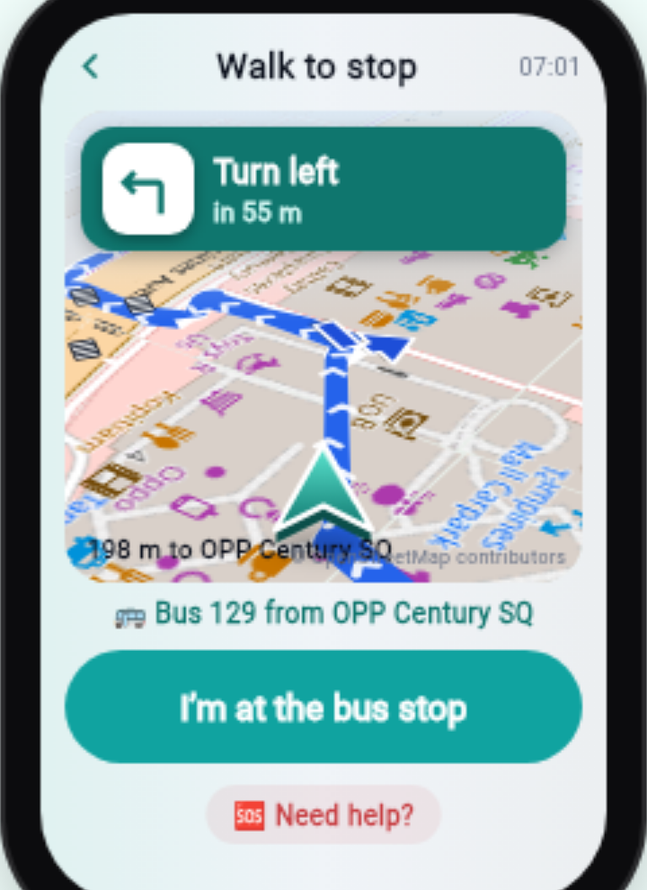
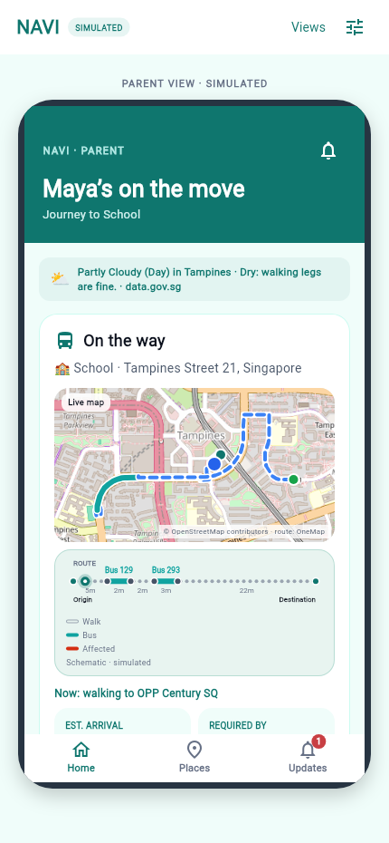
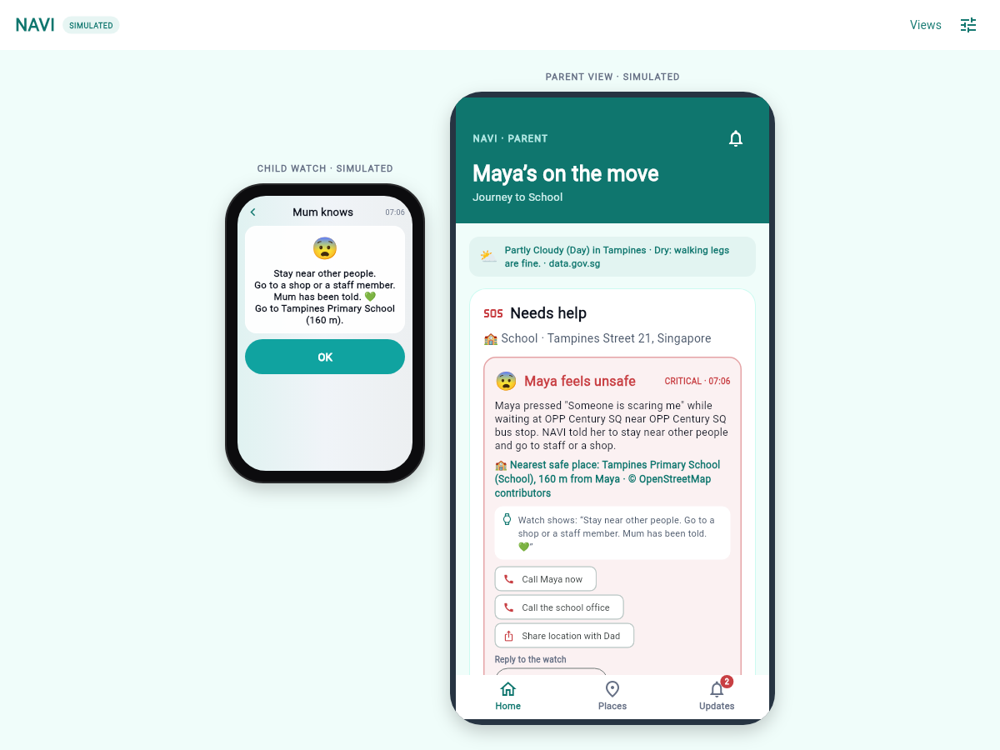
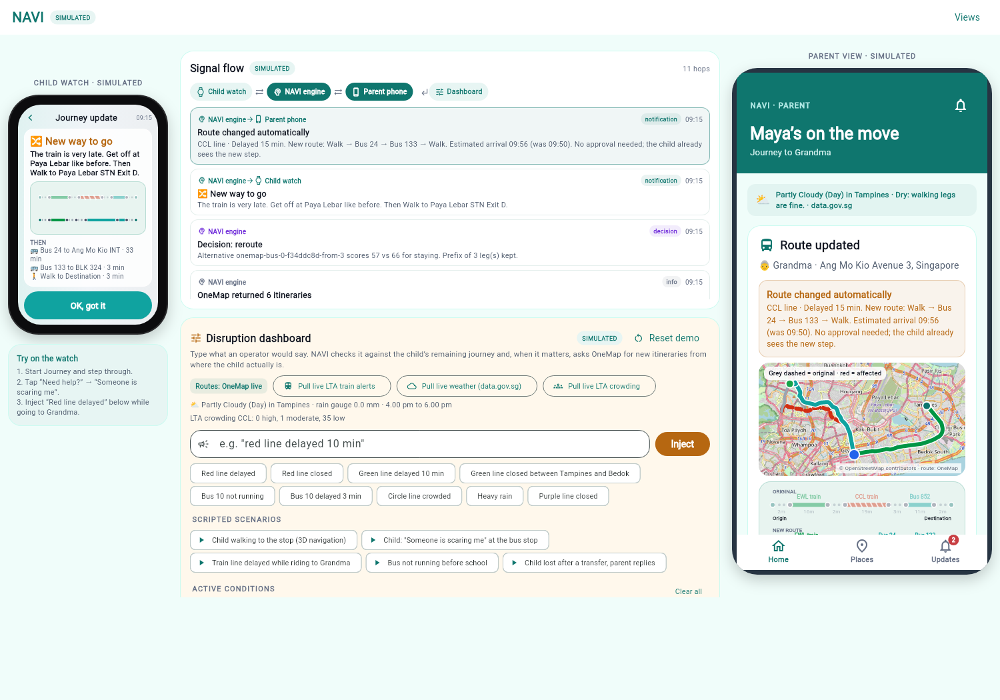

<p align="center">
  
</p>

# NAVI

A travel companion for a primary school child making public transport journeys
alone in Singapore, with a parent watching from their phone. The child sees one
instruction at a time on a watch. When the network breaks, NAVI re-plans from
where the child is actually standing and tells them what to do, without waiting
for the parent to approve anything.

Built for **NEBULA X / LTA PS2, Smart Commuter Companion**. Mobile-first web app.

- **Demo recording:** _[ADD YOUR LINK HERE before submitting]_
- **Write-up:** [WRITEUP.md](WRITEUP.md) — persona, architecture, assumptions, limitations

---

## Prerequisites

| Need | Version | Notes |
| --- | --- | --- |
| Flutter with web support | 3.47 or newer | Verified on 3.47.4. `brew install --cask flutter`, or unzip the official archive and put its `bin` on your `PATH` |
| Python | 3.11 or newer | Verified on 3.13. Runs the local API that holds the credentials |
| A modern browser | — | Chrome or Safari. The app is designed for a phone browser |

No database, no cloud project and no paid service. Both API keys are free.

## Configuration

Two free accounts. Register, then copy the example file and fill it in:

```sh
cp .env.example .env
```

| Variable | Where to get it |
| --- | --- |
| `ONEMAP_EMAIL`, `ONEMAP_PASSWORD` | Free account at https://www.onemap.gov.sg/apidocs/ |
| `LTA_ACCOUNT_KEY` | Free AccountKey at https://datamall.lta.gov.sg |

`.env` is git-ignored and no key is committed anywhere in this repository's
history. The keys stay in the Python backend; the Flutter app never holds one.

**Without keys the app still runs.** It falls back to labelled offline fixtures
and says so on screen, so you can open it before registering for anything.

## Install and run

Two terminals, copy-paste in order.

**Terminal 1, the backend:**

```sh
cd backend/mock
python3 -m venv .venv
.venv/bin/pip install -r requirements.txt
.venv/bin/uvicorn main:app --host 0.0.0.0 --port 8080
```

Check it: http://127.0.0.1:8080/health should report `"onemapConfigured": true`.

**Terminal 2, the app:**

```sh
cd apps/web
flutter pub get
flutter run -d chrome --web-hostname 127.0.0.1
```

Flutter prints a localhost URL. Open it.

**To open it on a real phone** on the same network, point the app at this
machine instead of localhost:

```sh
flutter run -d web-server --web-hostname 0.0.0.0 --web-port 8081 \
  --dart-define=NAVI_API=http://<your-computer-ip>:8080
```

Then browse to `http://<your-computer-ip>:8081` on the phone.

## What to click

The app opens on a menu of four views. **Tap "Demo lab".** It puts the child's
watch and the parent's phone side by side with a dashboard between them for
triggering disruptions, because real ones do not happen on cue.

The one journey to try, about ninety seconds:

1. Under **Scripted scenarios**, tap **"Train line delayed while riding to Grandma"**.
   It plans a real OneMap route, walks the child partway along it, then injects a
   delay on the line she is about to board.
2. Watch both devices react at once. The watch gets one instruction. The phone
   gets the reasoning, the new route and the new arrival time.
3. Read the middle column. Every hop is listed, including the engine's decision
   and the score it compared against waiting.
4. On the watch, tap **"Need help?"** then **"Someone is scaring me"**. The watch
   names the nearest safe place from OpenStreetMap; the phone gets a critical
   alert with one-tap replies that appear back on the wrist.

On a phone the same four views appear as tabs. Deep links jump straight to a
scenario: `/#lab/redline`, `/#lab/scared`, `/#child/walk`, `/#parent/walk`.

## What is live and what is simulated

Everything simulated is labelled as such in the interface.

| Piece | Source |
| --- | --- |
| Route candidates, legs, stop codes, geometry, walking steps | **OneMap** public-transport routing |
| Re-planning after a disruption | **OneMap**, re-queried from the child's actual position, then bus-only if every itinerary is still affected |
| Map tiles and pedestrian detail (crossings, steps, sheltered walkways, safe places) | **OpenStreetMap**, via community tiles and the Overpass API, cached |
| Train service alerts, station crowding, bus arrival times | **LTA DataMall** |
| Weather and rainfall | **data.gov.sg**, no key required |
| Disruptions typed into the dashboard | Simulated, labelled, and permitted by the brief as injected test data |
| The child's location and the clock | Simulated. NAVI never asks the browser for GPS |
| Notifications | In-app only. No push service |

## Screenshots

| View | Deep link | |
| --- | --- | --- |
| Child watch, 3D walking navigation | `/#child/walk` |  |
| Parent phone, journey in progress | `/#parent/walk` |  |
| Both, after a help request | `/#combined/scared` |  |
| Demo lab, after a live reroute | `/#lab/redline` |  |

## Repository layout

```
README.md          this file
WRITEUP.md         persona, architecture, assumptions, limitations
.env.example       variable names, no values
apps/web/          the Flutter web app
backend/mock/      the Python API that holds the credentials
docs/              brand assets, screenshots, product spec, open decisions
```

Inside `apps/web/lib`:

| Folder | What is in it |
| --- | --- |
| `engine/` | Reroute decision logic and geodesy. Pure Dart, no Flutter imports, unit tested |
| `models/` | Routes, journeys, conditions, signals. Mirrors `backend/src/contracts/index.ts` |
| `services/` | HTTP client for the local backend. Holds no keys |
| `state/` | The single shared store behind all four views |
| `screens/`, `widgets/`, `demo/` | Child watch, parent phone, maps, demo lab |

## Tests

```sh
cd apps/web && flutter analyze && flutter test
```

32 tests covering the decision engine, the disruption phrase parser, turn
detection, the condition models and the end-to-end store behaviour.

## Attribution

Routing and geocoding © OneMap / Singapore Land Authority. Map data ©
OpenStreetMap contributors, ODbL. Transport data © LTA DataMall. Weather data ©
data.gov.sg.
